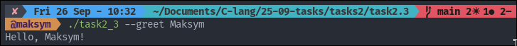
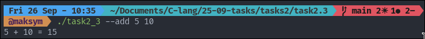

## TASK 2: BASIC VALIDATION

### Tasks number 2.1 provides the basic validations

To start the program

```
./task2.c <Name> <Age> #Will output: Hello <Name>, you are <Age> years old!
```

The example input/output:


### Tasks number 2.2 provides Multiple Valid Counts

- With 1 arg: prints "Hello [name]!"
- With 2 args: prints "Hello [name], you are [age]!"
- With 3 args: prints "Hello [name], you are [age] from [city]!"

To start the program:

```
./task2.c <Name> #Will output: Hello <Name>!
```

```
./task2.c <Name> <Age> #Will output: Hello <Name>, you are <Age>!
```

```
./task2.c <Name> <Age> <City> #Will output: Hello <Name>, you are <Age> from <City>!
```

The example input/output:


### Tasks number 2.3 Required vs Optional Arguments

To start the program

```
./program --greet <name> # Will output: Hello <Name>!
```
```
./program --add <num1> <num2> # Will output: <num1> + <num2> = <result>!
```
```
./program --list # Will output: Listing items... 
```

The example input/output:



