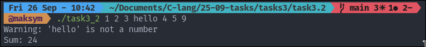
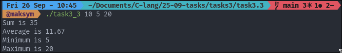

## TASK 3: WORKING WITH NUMBERS

### Tasks number 3.1 provides Simple Calculator

To start the program

```
./task3_1 <num1> <operator> <num2> #Will output: <result>
```

The example input/output:


### Tasks number 3.2 provides Sum All Numbers

To start the program

```
./task3_2 1 2 3 hello 4 5 # Will output: 
Warning: 'hello' is not a number 
Sum: 24
```

The example input/output:



### Tasks number 3.3 provides  Number Statistics

To start the program

```
./task3_3 10 5 20 # Will output: 
Sum is 35
Average is 11.67
Minimum is 5
Maximum is 20
```

The example input/output:

### Tasks number 3.3 provides  Number Statistics

To start the program

```
./task3_3 10 5 20 # Will output: 
Sum is 35
Average is 11.67
Minimum is 5
Maximum is 20
```

The example input/output:


### Tasks number 3.4 provides Number Base Converter

To start the program

```
./converter <number> <from_base> <to_base> # Will output: <code>
```

The example input/output:


