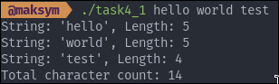
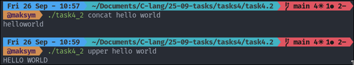
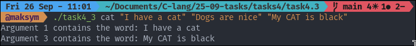

## TASK 4: STRING PROCESSING

### Tasks number 4.1 provides String Length Counter

The program 
- Takes multiple string arguments
- Prints each string with its length
- Prints total character count

To start the program

```
./task4_1 hello world test #Will output:
String: 'hello', Length: 5
String: 'world', Length: 5
String: 'test', Length: 4
Total character count: 14
```

The example input/output:



### Tasks number 4.2 provides String Operations 

What the program can do: 
- upper: convert all strings to uppercase
- lower: convert all strings to lowercase
- reverse: reverse each string individually
- concat: concatenate all strings

To start the program

```
./task4_2 upper hello world # Will Output 
HELLO WORLD 
```

The example input/output:



### Tasks number 4.3 provides String Operations 

What the program can do: 
- Search for word in all text arguments
- Print which arguments contain the word
- Case insensitive search

To start the program

```
./task4_3 <word> <text1> <text2> ...
```

The example input/output:

