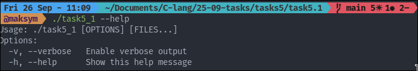
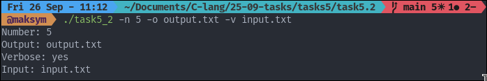
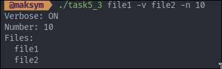
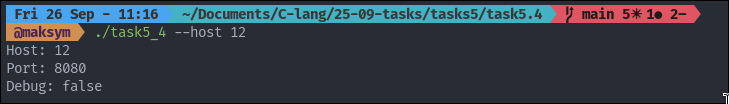

## TASK 5: FLAGS AND OPTIONS

### Tasks number 5.1 provides Simple Flags

The program do: 
- -v or --verbose: enable verbose output
- -h or --help: show help message
- Process remaining arguments normally

To start the program:

```
./task5_1 -v file1 file2
```

The example input/output:



### Tasks number 5.2 provides Flags with Values

The program do: 
- Flags can appear anywhere: ./program file1 -v file2 -n 10
- Multiple files and multiple flags
- Unknown flags should show error

To start the program:

```
./task5_2 -v file1 file2
```

The example input/output:



### Tasks number 5.3 provides Mixed Arguments Parser

The program do: 
- -n <number>: set a number value
- -o <filename>: set output filename
- -v: verbose flag (no value)

To start the program:

```
./task5_3 file1 -v file2 -n 10    
```

The example input/output:



### Tasks number 5.4 provides Configuration Override

Program with defaults:

- Default port: 8080
- Default host: localhost
- Default debug: false

To start the program:

```
./task5_3 file1 -v file2 -n 10    
```

The example input/output:


