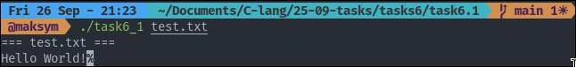
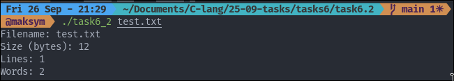

## TASK 6: FILE OPERATIONS

### Tasks number 6.1 provides File Display

The program will: 
- Display contents of each file
- Print filename before content
- Handle file opening errors gracefully

To start the program:

```
./task6_1 <file1> <file2>
```

The example input/output:



### Tasks number 6.2 provides Simple File Statistics

The program will print for each line:
- Filename
- Size in bytes
- Number of lines
- Number of words

To start the program:

```
./task6_2 <file1> 
```

The example input/output:

